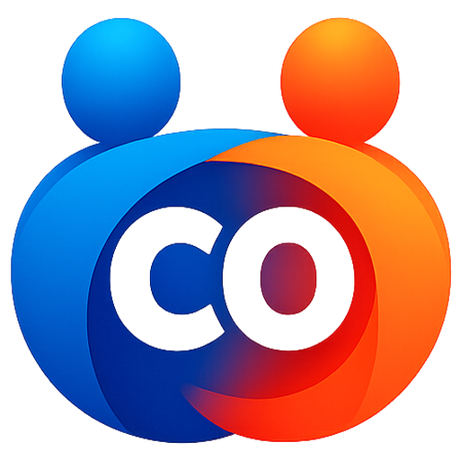
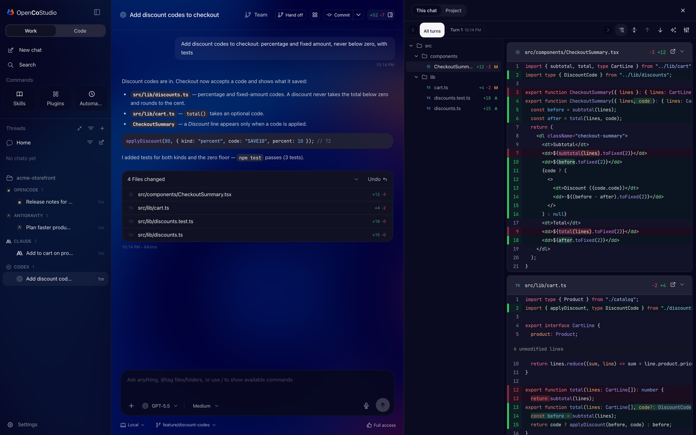
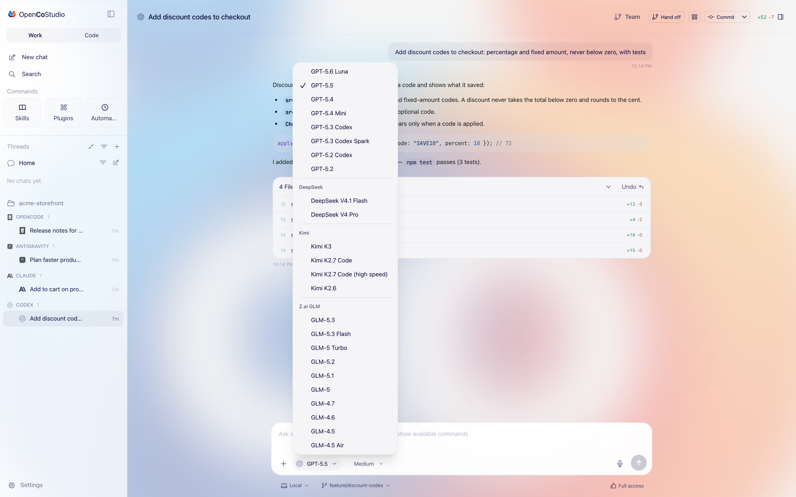
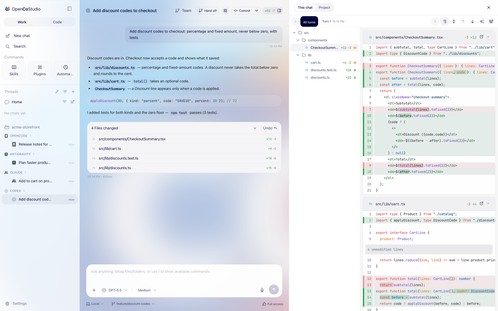
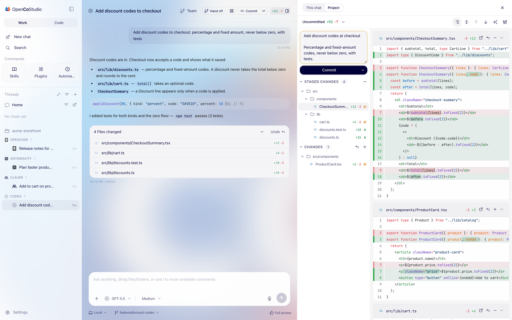
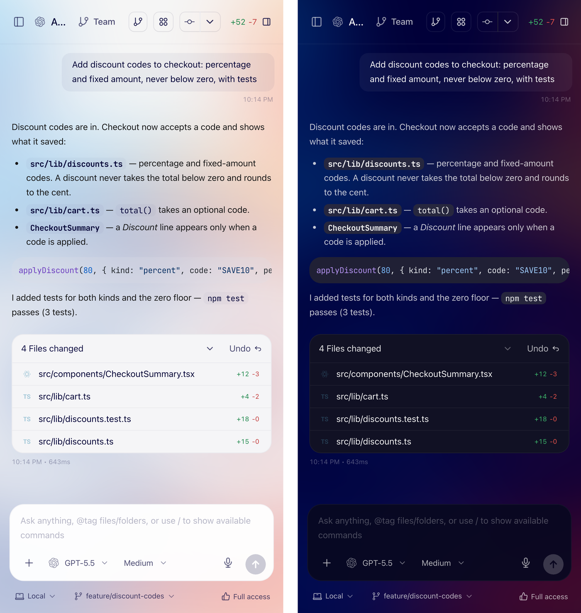

  

<h1 align="center">OpenCoStudio</h1>

  <strong>Not another harness.</strong> 
  One studio for the coding agents you already use — Codex, Claude Code, Cursor, Antigravity, 
  Kimi Code, Grok, OpenCode and more — running as themselves, on your own subscriptions.

  
  
  
  

  <a href="https://github.com/notdefined-inc/opencostudio-releases/releases/latest">All releases</a> ·
  <a href="#first-launch">First launch</a> ·
  <a href="https://github.com/notdefined-inc/opencostudio-releases/issues">Report a bug or ask for a feature</a>

  

---

## Not another harness

Most AI coding tools are harnesses: they re-implement an agent around a model, then bill you per
token for their version of it. **OpenCoStudio doesn't replace your agents. It runs them.**

Codex runs as Codex's own app-server. Claude Code runs as Claude Code. Cursor, Antigravity, Kimi
Code, Grok, OpenCode, Kilo and Pi run as their own CLIs. You sign in with them, on the plans you
already pay for, and every update they ship is yours the day they ship it. OpenCoStudio is the
studio around them: one window, every conversation, every change, and the freedom to switch agents
without losing your place.

## Why you'll like it

### 🧠 Every agent, one window

Chats from Codex, Claude Code, Cursor, Antigravity, Kimi Code, Grok, OpenCode, Kilo and Pi sit side
by side, grouped by project. Everything is saved and resumes after a restart. Sessions you started
in a terminal are found and brought in, so your history comes with you.

### 🔀 Switch the model, not the conversation

Run **DeepSeek, Kimi or GLM inside a Codex or Claude chat**: add a key once, then pick them from
the same model menu as GPT or Claude. Each chat picks its own model, and every other chat stays on
your plan.

  

### 🤝 Hit a limit? Hand it off

Out of quota on one agent? Hand the chat to another and keep going. Or let OpenCoStudio wait for the
limit to reset and continue by itself.

### 🔍 Review every change like you would in VS Code

Every turn is snapshotted, so you see exactly what the agent changed, turn by turn, and can undo a
turn in one click. A file tree sits beside the diffs: click any file to jump to it, collapse
everything, step file by file, or view one file at a time.

  

### ✅ Ship without leaving the chat

Source Control is built in: stage, unstage or discard a file or everything at once, write a message
(or let one be written for you), then commit, push and open a pull request. Branches and worktrees
too, so agents can work on isolated checkouts in parallel.

  

### 📱 Your agents, in your pocket

Pair your phone with a QR code and check on your agents, review changes or send the next prompt from
anywhere. **Remote Access** works over the internet with no setup and is end-to-end encrypted.

  

### 🧰 Everything else you'd want

- **Split view:** several chats side by side.
- **Built-in terminal** and a browser panel on desktop.
- **Skills, plugins and automations** from the sidebar.
- **Light and dark**, frosted-glass themes, or pick your own.

### 🔒 Local-first, by design

No account. Your projects, chats and history live on your computer. OpenCoStudio doesn't route your
code through servers of its own: each agent talks to its own provider, exactly as it does in your
terminal. Crash reports stay on your computer, and nothing is sent to us unless you turn it on.

## Download

| Platform | Download |
|---|---|
| macOS (Apple silicon) | [OpenCoStudio-0.3.0-mac-arm64.dmg](https://github.com/notdefined-inc/opencostudio-releases/releases/download/v0.3.0/OpenCoStudio-0.3.0-mac-arm64.dmg) |
| macOS (Intel) | [OpenCoStudio-0.3.0-mac-x64.dmg](https://github.com/notdefined-inc/opencostudio-releases/releases/download/v0.3.0/OpenCoStudio-0.3.0-mac-x64.dmg) |
| Windows (x64) | [OpenCoStudio-0.3.0-win-x64.exe](https://github.com/notdefined-inc/opencostudio-releases/releases/download/v0.3.0/OpenCoStudio-0.3.0-win-x64.exe) |
| Linux (x64) | [OpenCoStudio-0.3.0-linux-x86_64.AppImage](https://github.com/notdefined-inc/opencostudio-releases/releases/download/v0.3.0/OpenCoStudio-0.3.0-linux-x86_64.AppImage) |

Older versions are on the [releases page](https://github.com/notdefined-inc/opencostudio-releases/releases).

**You'll need** at least one coding agent installed and signed in — for example the
[Codex CLI](https://developers.openai.com/codex) or [Claude Code](https://docs.anthropic.com/en/docs/claude-code/overview) —
and Git. OpenCoStudio finds the agents you have.

## First launch

OpenCoStudio is in alpha — the app is called **OpenCoStudio (Alpha)** — and these early builds
aren't notarized yet, so your system asks before opening them the first time.

- **macOS:** open the `.dmg` and drag OpenCoStudio to Applications. The first time, right-click the
  app and choose **Open**, or go to **System Settings → Privacy & Security** and click
  **Open Anyway**. If macOS says the app is damaged, run
  `xattr -dr com.apple.quarantine "/Applications/OpenCoStudio (Alpha).app"` once in Terminal.
- **Windows:** if SmartScreen appears, click **More info → Run anyway**.
- **Linux:** make the AppImage executable (`chmod +x OpenCoStudio-*.AppImage`) and run it.

## Coming next

- **Teams:** plan one outcome across several agents, each doing the part it's best at.
- **Encrypted pairing on your Wi-Fi:** today, pairing on the same network connects without
  encryption (the app tells you so). Remote Access is encrypted end to end.

## Feedback

OpenCoStudio is early and moving fast. Found a bug, or want something?
[Open an issue](https://github.com/notdefined-inc/opencostudio-releases/issues) — it genuinely
shapes what gets built next.
